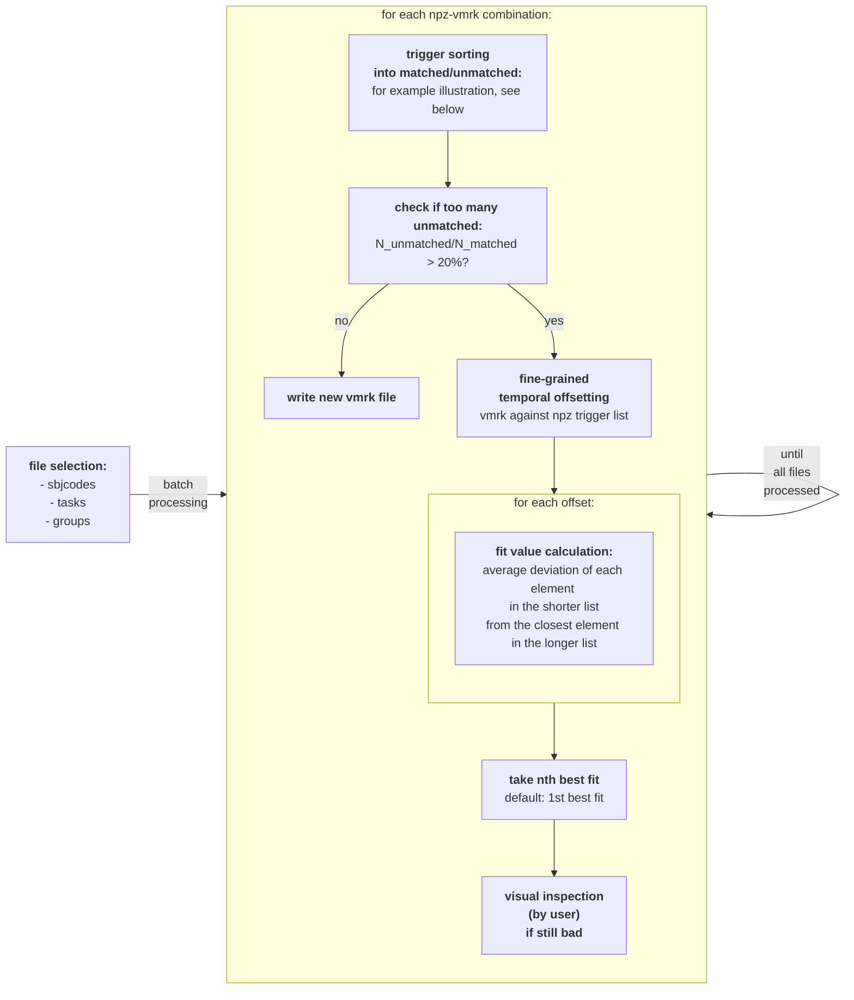

# Trigger-Fix
aligns and matches triggers from log file and EEG file

Basic algorithm (flowchart; WIP)



Illustration of function ```sort_trigs_into_matched_unmatched```:


Basic algorithm:
- processing happens in batches via specifying parameters for file selection and for tweaking the fitting process
- initial attempt at aligning triggers via "moving heads" (i.e. incrementing indices) function:
	- Start at the first vmrk and npz triggers in the list (both indices/"heads" at 0)
 	- Compare current entries of vmrk and npz based on trigger identity and time
	- Append matched entries (within a temporal lenience specified by the user) to matched dataframes ("match_vmrk", "match_npz") and incrementing both indices;
	- if unmatched, append to respective unmatched dataframes ("only_vmrk", "only_npz") and increment the lagging index.
	- repeat until all triggers are sorted 
- This sorting via the "moving_heads" function is considered "bad" when the ratio of unmatched triggers to matched triggers exceeds 20%, triggering an iterative brute-force search approach:
	- this brute force search shifts npz and vmrk markers systematically against each other in a fine-grained manner, calculating fit values (by default, focusing on the middle portion of the data to ignore start/stop discrepancies (e.g. when EEG recording was started too late/stopped too early))
		- NOTE!!! this shifting/re-alignment happens within the "min_dev" function, which the creator does not yet correctly understand. (it works, as shown by the visual diagnostic plots, but the creator has to re-figure out how & why.)
	- how these fit value are calculated: as average deviation of each element in the shorter list from the closest element in the longer list. (i.e. lower values indicate better alignment)
	- then taking the best fit, unless the visual inspection by user indicates that "best" solution is systematically off - user can then specify to select 2nd, 3rd, ... nth best fit solution
- diagnostic plot then tells at a glance if/how well the picked solution from brute force search has worked. black lines indicate matches, while colored lines indicate triggers that only appear in npz or vmrk. if there are few black lines but many red and green lines, this is a strong indicator that the matching needs to be finetuned (by the tweaking params mentioned in the beginning).

How to use:
- clone this repo
- adjust ```data/lab_parameters.xlsx``` if necessary: adding an entry with your lab-specific parameters.
- ```cd Trigger-Fix```
- ```conda env create --name trigfix-env --file environment.yml```
- ```conda activate trigfix-env```
- ```pip install -e .```
- ```code scripts/trigger_corr.ipynb```
