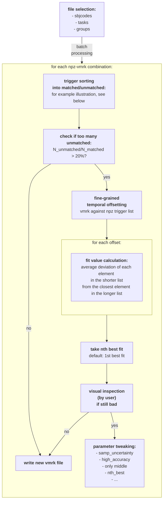

# Trigger-Fix
aligns and matches triggers from log file and EEG file

How to use:
- clone this repo
- adjust ```data/lab_parameters.xlsx``` if necessary: adding an entry with your lab-specific parameters.
- ```cd Trigger-Fix```
- create environment, once: ```conda env create --name trigfix-env --file environment.yml```
- activate environment: ```conda activate trigfix-env```
- install module: ```pip install -e .```
- run VS code to start the trigger fix (install [VS Code](https://code.visualstudio.com/download) first for this to work): ```code scripts/trigger_corr.ipynb```

Basic algorithm (flowchart; WIP)




Illustration of function ```sort_trigs_into_matched_unmatched```:


